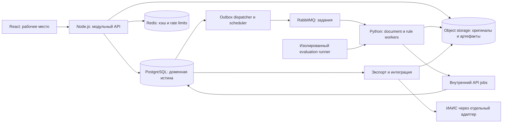

# Архитектура «Инспектор ИИ»: спецификация для реализации

Версия 1.2, 18 сентября 2026. Статус: **целевое проектное решение, не описание реализованных возможностей**. Основание: [ТЗ](source/10-Мосстройнадзор.pdf), [аудит](AUDIT_REPORT_2026-09-17.md) и [официальная сессия Q&A](HACKATHON_QA_SESSION.md). Код и миграции должны реализовать эти контракты; их текущее наличие не означает соответствия.

## Навигация

| Документ | Назначение |
|---|---|
| [01 — Решения и границы](architecture/01_DECISIONS.md) | Компоненты, ответственность, решения и компромиссы |
| [02 — Домен и данные](architecture/02_DOMAIN_DATA.md) | Сущности, идентификаторы, ограничения, версии, provenance |
| [03 — Состояния и транзакции](architecture/03_STATE_AND_CONSISTENCY.md) | Загрузка, запуск, review, дозагрузка, финализация и отмена |
| [04 — API](architecture/04_API_CONTRACTS.md) | Маршруты, payload, concurrency, валидация и ошибки |
| [05 — Jobs и события](architecture/05_JOBS_AND_EVENTS.md) | Очереди, DAG, доставка, leases, идемпотентность и повторы |
| [06 — Обработка документов](architecture/06_DOCUMENT_PIPELINE.md) | Ingest, OCR, layout, геометрия, метаданные, редакции и linking |
| [07 — Правила и evidence](architecture/07_RULES_AND_EVIDENCE.md) | Матрица, нормализация, доказательства и свободный поиск |
| [08 — Review и выходные документы](architecture/08_REVIEW_PROTOCOL_EXPORT.md) | Решения, GOLD-кандидаты, протокол, submission и ИАИС |
| [09 — Evaluation и модели](architecture/09_EVALUATION_AND_MODELS.md) | Разметка, split, метрики, model gate и rollback |
| [10 — Frontend](architecture/10_FRONTEND.md) | Экраны, данные, viewer, ошибки и доступность |
| [11 — Эксплуатация и защита](architecture/11_OPERATIONS_SECURITY.md) | Развёртывание, RBAC, observability, лимиты и восстановление |
| [12 — Реализация и приёмка](architecture/12_DELIVERY_AND_ACCEPTANCE.md) | Задачи, зависимости, миграция и критерии приёмки |
| [13 — Открытые решения](architecture/13_OPEN_QUESTIONS.md) | Внешние зависимости, временные правила и release blockers |
| [14 — Все 132 параметра](architecture/14_PARAMETER_IMPLEMENTATION_MATRIX.md) | Поэлементная декомпозиция: extraction, comparator families и gates |
| [15 — Provider selection](architecture/15_PROVIDER_SELECTION.md) | Выбор провайдеров, два resource profile, лицензии, параметры и qualification gates |

Backend начинает с 02–05 и 08; ML/document processing — с 02, 05–07, 09, 14 и 15; frontend — с 03–04, 08 и 10; инфраструктура — с 05, 11 и 15; ответственный за выпуск — с 12–13. Объяснения находятся в 01, справочные контракты — в 02–11, 14 и 15, порядок выполнения — в 12. Tutorials следует писать после реализации, когда команды запуска станут проверенными.

## Система

Workers не изменяют доменные таблицы напрямую. Внутренний API принадлежит тому же Node-приложению, но недоступен из браузера. Evaluation использует тот же inference-код и изолированные данные/учётные записи.

## Инварианты

| ID | Гарантия |
|---|---|
| INV-01 | Обычный анализ не читает public/gold labels; seed существует в отдельном demo-контуре |
| INV-02 | Run ссылается на неизменяемый manifest и фиксированный release моделей/правил |
| INV-03 | Evidence не пересекает границу объекта и разрешённого состава manifest |
| INV-04 | Неприменимость, неполнота, технический сбой и отсутствие реализации различаются |
| INV-05 | CONFIRMED_VIOLATION возникает только из аутентифицированного решения инспектора |
| INV-06 | Неизвестное утверждение или неоднозначная редакция блокируют предметный вывод |
| INV-07 | Машинный прогноз сохраняется независимо от review |
| INV-08 | Финальный протокол — immutable snapshot; исправления создают новые события/версии |
| INV-09 | Повтор запроса или сообщения не создаёт повторного доменного эффекта |
| INV-10 | Старый job не изменяет активный run, решения или финальный протокол |
| INV-11 | Метрики и уверенность не генерируются константой или порядком строки |
| INV-12 | Hidden test не используется для обучения и подбора порогов |
| INV-13 | В ИАИС уходят только подтверждённые записи действующего финального протокола |
| INV-14 | До успешной AV-проверки файл остаётся в изолированном карантине |
| INV-15 | Документы и их фрагменты не передаются внешним AI/OCR/VLM API; inference выполняется локально разрешёнными model artifacts |

## Граница прототипа

Первый рабочий релиз закрывает PDF → извлечение → несколько High-правил → evidence → решение → дозагрузка → сохранный протокол. Все 132 параметра присутствуют в coverage ledger, но неисполненные правила обозначаются UNSUPPORTED. DWG, live ИАИС/УКЭП и 100-user load test не входят в первый хакатонный gate. Это ограниченный прототип, а не полное соответствие ТЗ.

Дальнейшие релизы расширяют форматы и семейства правил, добавляют управляемый GOLD, свободный поиск, нормативное администрирование, интеграции и эксплуатационные гарантии. Остаток виден в продукте и release manifest. Разделение этапов не отменяет требований ТЗ.
