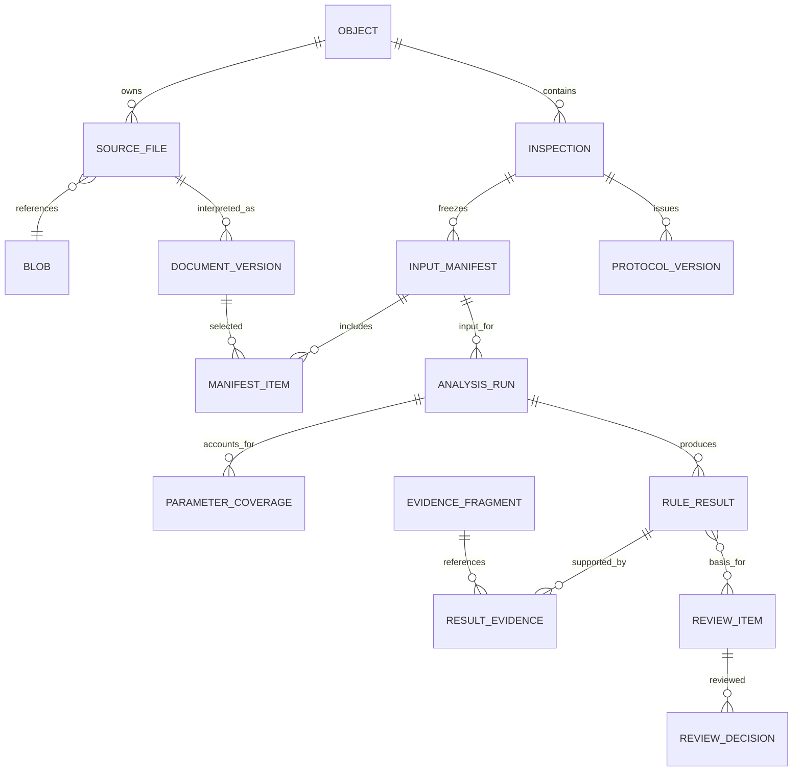

# Домен, данные и ограничения

Версия 1.0. Логическая схема будущих миграций, не исполняемый SQL. Связанные документы: [состояния](03_STATE_AND_CONSISTENCY.md), [API](04_API_CONTRACTS.md), [jobs](05_JOBS_AND_EVENTS.md).

## Идентификаторы

- Внутренние ID — полные UUID, генерирует сервер. Внешние object_id/file_id/parameter_code сохраняются отдельно, без переименования.
- Время — UTC RFC3339; даты из документа без времени хранятся как date. Лист — строка, PDF-страница — целое от 1.
- SHA-256 — 64 lowercase hex. Decimal передаётся строкой; размер файла — байты.
- Пользовательские сущности имеют organization_id; объектные — object_id. Принадлежность всех связей проверяется составными FK и транзакционными проверками.
- Изменяемые агрегаты имеют row_version bigint. Append-only записи содержат created_at и actor/service principal.
- Канонизация snapshots `inspector-c14n-v1`: UTF-8, сортированные ключи, без незначащих пробелов, NFC для текстовых metadata, Decimal уже строка. Порядок каждого массива задан контрактом. Hash исходного файла считается по raw bytes, без нормализации.

## Связи

## Реестр сущностей

Общие ID, organization_id, object_id, timestamps ниже не повторяются. Поля с `?` допускают null; остальные обязательны для указанного состояния.

| Сущность | Ключевые поля | Ограничения |
|---|---|---|
| users / memberships | login/provider_subject, password_hash?, enabled, role | Автор решения определяется сессией |
| object_memberships | user_id, object_id, permission_set | Scope чтения и изменения |
| objects | external_id?, name, address, customer?, contractor?, permit_number? | External ID уникален в namespace источника |
| inspections | lifecycle, active_run_id?, working_manifest_id?, row_version, mode, as_of_date, scenario | Один активный run внутри цикла; дата среза входит в manifest |
| upload_sessions | inspection_id, state, limits_snapshot, idempotency_key, expires_at | Intake не равен комплектности |
| upload_items | session_id, client_name, received_bytes, hash?, quarantine_key?, state, error_code? | Статус каждого файла |
| blobs | sha256, byte_size, storage_key, av_report_id, media_type | UNIQUE(object_id, sha256), неизменяемые байты |
| source_files | blob_id, canonical_name, original_format, registered_at | Каноническая регистрация blob в объекте |
| source_aliases | source_file_id, upload_item_id, original_name, supplied_stage_hint | Повторная загрузка не увеличивает physical file count |
| dataset_file_bindings | dataset_version, official_file_id, official_object_id, source_file_id | UNIQUE(dataset_version, official_file_id), контроль hash |
| document_versions | source_file_id, metadata_version, page_selector, stage, discipline, code_raw/normalized, revision_raw/normalized, approval_status/date, effective_from?, supersedes_id? | Append-only интерпретация файла/диапазона; stage hint не доказательство |
| run_document_versions | run_id, document_version_id, metadata_artifact_id, role | OUTPUT_INTERPRETATION связывает извлечённые metadata с замороженным входным blob |
| metadata_assertions | document_version_id, field, value, evidence_fragment_id?, origin, quality | Происхождение поля и конфликтующие значения |
| metadata_resolutions | inspection_id, assertion_ids, selected_value, reason_code, comment, actor_id | Входит в следующий manifest; исходные assertions не редактируются |
| input_manifests | inspection_id, sequence, canonical_json, hash, parent_id?, dataset_version, resolutions_hash | UNIQUE(inspection_id, sequence), immutable |
| manifest_items | manifest_id, source_file_id, blob_sha256, document_version_id, inclusion_role | Включает исходные метаданные и все допустимые источники |
| analysis_runs | inspection_id, manifest_id, release_id, run_state, started/completed_at, supersedes_run_id?, output_hash? | Вход заморожен; output immutable после seal |
| analysis_releases | release_id, schema_version, lifecycle, content_hash, content_json, external_network_allowed | Append-only manifest; run/jobs ссылаются FK; новый provider/config означает новый release |
| pages | source_file_id, renderer/config version, source_page_number?, rendered_page_number, width/height, crop/rotate/transform, artifact_id | Отображение source↔rendered обязательно |
| artifacts | kind, storage_key, sha256, byte_size, producer_job_id, config_hash, lifecycle | READY только после принятого commit |
| extraction_runs | source_file_id, input_hash, adapter_version, config_hash, quality_summary, output_artifact_id | Reusable extraction; решений человека нет |
| extracted_values | extraction_run_id, entity_key, field_key, raw_value, normalized_json, unit, fragment_id, quality | Значение связано с первоисточником |
| document_links | run_id, entity_key, source_version_ids, reasons, alternatives, resolution_ref?, link_state | Frozen выбор сопоставимых редакций |
| evidence_fragments | source_file_id, document_version_id, page_id?, locator_kind, bbox/polygon?, text?, role, fragment_hash | Source hash и geometry version обязательны для page evidence |
| rule_results | run_id, rule/version, parameter_code?, matrix_scope, entity_key, execution_status, machine_status?, reason_code?, values, delta?, link_id?, evidence_fingerprint | UNIQUE(run, rule, entity, comparison_variant), immutable output |
| result_evidence | result_id, fragment_id, role, source_stage | Несколько источников на expected/actual/context |
| parameter_coverage | run_id, parameter_code, execution_rollup, applicability_rollup, result_count, counts_by_status, reasons | Ровно 132 строки для соответствующей matrix version; free search отдельно |
| source_requirements / completeness_assessments | rule/scenario version, stage/type/entity scope, required roles; run_id, matched_sources, status, gaps/reasons | Требования и оценка комплектности раздельны; один файл стадии не закрывает все требования |
| finding_groups | run_id, entity_key, issue_type, member_result_ids, display_group_key | UI-группа не подменяет atomic result |
| review_items | inspection_id, run_id, origin, entity_key, evidence_fingerprint, parent_item_id?, lifecycle, row_version | Отдельный агрегат review; MACHINE/HUMAN_SPLIT/HUMAN_PROMOTION; ACTIVE/SUPERSEDED |
| review_item_sources | review_item_id, result_id, evidence_subset, immutable_annotation_ref? | M:N provenance; все ссылки одного объекта/run |
| review_decisions | review_item_id, action, reason_code, comment, actor_id, supersedes_decision_id?, evidence_fingerprint, source_decision_id?, original_actor/time?, copied_at? | Append-only, наследование явно связано с оригиналом |
| clarification_requests | inspection_id, review_item_id?, missing_requirements, target_user/role?, due_at?, state, resolution_note? | Внутренняя задача; внешняя отправка — отдельное действие |
| protocol_versions | inspection_id, version, kind, snapshot_json/hash, run_id, decision_set_hash, created_by, finalized_at? | UNIQUE(inspection, version), immutable |
| protocol_artifacts | protocol_id, format, template_version, render_state, artifact_id? | PDF failure не меняет snapshot |
| protocol_revocations | protocol_id, actor_id, reason, created_at, replacement_id? | Отзыв не меняет исходные bytes |
| integration_deliveries | protocol_id, destination, idempotency_key, state, attempt, receipt?, next_attempt_at | UNIQUE(protocol, destination, operation) |

## Управление правилами, моделями и заданиями

| Сущности | Обязательное содержание |
|---|---|
| matrix_versions / parameter_definitions | Source artifact/hash, оригинальный код/название/trigger/criticality; опубликованная версия immutable |
| rule_versions / normative_versions | Typed comparator, applicability, thresholds, нормативные ссылки/сроки, утверждение; параметр → 1..N atomic rules |
| mapping_versions | Source code, canonical parameter, интерпретация, происхождение, review state; не переписывает каталог |
| model_releases / model_artifacts | Artifact hashes, adapter/config/prompt versions, rules/matrix, evaluation_report, approval, rollback_ref |
| dataset_versions / dataset_items / gold_annotations | Split, object_group_id, source fingerprints, curator review, эксперт, label, reason, date |
| evaluation_runs / evaluation_metrics | Frozen split hashes, predictions_hash, scorer_version, counts, CI method, срезы |
| training_runs / deployments | Dataset/base model/config refs, output candidate; deployment environment, previous/active release, approval/event refs |
| jobs / job_attempts / job_dependencies | Semantic key, input refs, lease/fence, run generation, state, attempt/error, output refs |
| outbox_events / consumer_receipts | Event ID, aggregate sequence, schema_version, payload, publish state; UNIQUE(consumer,event) |
| command_receipts | Actor, operation, idempotency_key, request_hash, response/status |
| audit_events | Actor/service, request/trace_id, action, target, before/after refs, reason, IP, user_agent, timestamp, event_hash |

## Идентичность сравниваемого элемента

Manifest замораживает исходные blobs, известные до запуска metadata/resolutions, as_of_date и scenario. OCR может открыть новую логическую интерпретацию или несколько стадий; это output текущего run в run_document_versions, а не изменение manifest. Evidence использует эту immutable document_version только если её source hash входил в manifest и metadata artifact принят для данного run. Повтор идентичной интерпретации переиспользует версию по source hash + selector + semantic metadata/policy hash, чтобы произвольный новый UUID не ломал перенос решений. Новый human resolution включается в следующий manifest. Так устраняется зависимость «нужно извлечь metadata до первого frozen run».

entity_key — структура: building, section, floor, room, system, element. Неизвестное значение — null. Сопоставлять по одному room допустимо только при доказанной уникальности и записанном основании. location_raw сохраняет конкурсное значение, display_location предназначен только для UI.

evidence_fingerprint включает source hashes и document versions, entity key, версии rule/mapping/normative, values, locator hashes, link/resolution provenance и analysis release. Ссылки сортируются по стабильным ID; изменение порядка отображения fingerprint не меняет. Изменение смыслового входа запрещает автоматический перенос решения.

## Геометрия и ограничения

bbox — ровно четыре числа xyxy: 0≤x0<x1≤1, 0≤y0<y1≤1. Polygon — минимум три неколлинеарные точки, без самопересечения; bounding box вычисляем. Нормализация относительно видимой области после CropBox/Rotate. Для abstention возможен source-only locator без bbox; он не удовлетворяет точной локализации положительного вывода.

Обязательны FK object→inspection→run→result, принадлежность fragments тому же объекту, диапазоны страниц, перечисления статусов и уникальные ключи из таблиц. Массив SQL NUMERIC[4] не заменяет явную проверку длины и порядка координат. JSONB подходит для typed payload/snapshot, но не заменяет FK.

Индексы: organization/object; inspection/run/state; result parameter/status/entity; job state/next_retry/lease_expiry; outbox publish state/sequence; audit target/time. Пагинация по устойчивой паре created_at+id.

## Хранилище и retention

Original key: org/{org}/objects/{object}/originals/{sha256}; имя — metadata. Derived key включает input hash, adapter version и config hash. Протоколы имеют отдельные immutable keys. Hash проверяется при приёме и чтении критичных артефактов.

Orphan artifacts после неудачного commit становятся кандидатами GC. Сборщик проверяет отсутствие ссылок из manifests/jobs/protocols и выдерживает retention; cache TTL не удаляет доказательства протокола. Срок документов согласуется отдельно. Карантин очищается независимо от originals.
