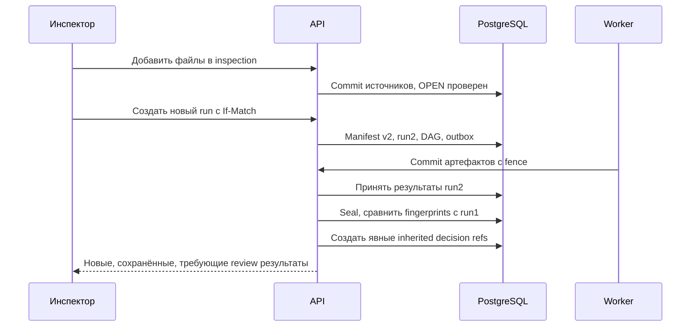

# Состояния, транзакции и конкурентные действия

Версия 1.0. Этот документ — единственный источник разрешённых переходов. Endpoint и worker не должны задавать произвольные статусы в обход доменных команд.

## Измерения статуса

| Измерение | Значения |
|---|---|
| Inspection lifecycle | OPEN, FINALIZED |
| Analysis run | QUEUED, RUNNING, SUCCEEDED, PARTIAL, FAILED, CANCELLED |
| Rule execution | NOT_RUN, RUNNING, SUCCEEDED, UNSUPPORTED, FAILED, CANCELLED |
| Machine status при SUCCEEDED | CANDIDATE, NEGATIVE_VERIFIED, MISSING_EVIDENCE, NOT_APPLICABLE, NOT_COMPARABLE, CLARIFICATION_REQUIRED, SUSPICION |
| Human action | CONFIRM, REJECT, CLARIFY, VERIFY_NEGATIVE |
| Review projection | PENDING, CONFIRMED_VIOLATION, NEGATIVE_VERIFIED, CLARIFICATION_REQUIRED, SUPERSEDED |
| Completeness | UNKNOWN, MISSING, PARTIAL, COMPLETE, NOT_APPLICABLE |
| Protocol kind | DRAFT, FINAL; действительность отзыва хранится отдельно |
| Sync | NOT_REQUESTED, QUEUED, SENDING, PENDING_SYNC, SYNCED, FAILED, CANCELLED, RECONCILIATION_REQUIRED |

Machine NEGATIVE_VERIFIED означает автоматическое сравнение без расхождения; negative GOLD требует экспертного решения. Review PENDING обязателен для CANDIDATE. У отрицательного machine result review может отсутствовать, что не скрывает его происхождение. UNSUPPORTED не имеет machine_status и не входит в число проверенных предметных групп.

## Загрузка

Upload session: CREATED → RECEIVING → QUARANTINED → VALIDATING → READY_TO_COMMIT → COMMITTED. Ошибка → REJECTED/FAILED; истечение → EXPIRED; явная отмена → CANCELLED. READY_TO_COMMIT не означает, что файл уже включён в inspection. Повтор успешно принятой передачи возвращает receipt без повторной записи bytes. При недостоверном исходе клиент сначала читает session; оборванная передача завершается FAILED, а повтор загрузки создаёт новую session/новый command key. Ключ успешно принятой команды нельзя использовать для другого содержимого.

Начало и commit загрузки требуют inspection OPEN и отсутствия QUEUED/RUNNING run. Вторая проверка обязательна: состояние могло измениться во время передачи. Inspection с незавершёнными upload sessions нельзя запустить/финализировать. Отмена session освобождает блокирующее условие, но не удаляет опубликованные файлы.

Commit пакета атомарен в БД: либо все валидные заявленные файлы пакета зарегистрированы, либо ни один. Политика v1 — при отказе одного файла весь пакет не коммитится, UI показывает конкретные ошибки. Частичный импорт корпуса имеет другой тип команды и явный отчёт по item; его нельзя выдавать за успешную пакетную загрузку.

Bytes сохраняются immutable до транзакции, после AV. Если БД отклоняет commit, объекты остаются непривязанными и позже очищаются GC. Распределённая транзакция S3+PostgreSQL не предполагается.

## Запуск и seal

Start analysis под блокировкой inspection проверяет OPEN, отсутствие активного job generation и unfinished uploads, наличие committed source. Создаёт новый manifest, run, 132 coverage rows, root jobs, outbox events; назначает active_run_id одной транзакцией. Manifest содержит исходные metadata versions; новые extracted assertions входят в output данного run, а подтверждённые ручные corrections — в manifest следующего run.

QUEUED → RUNNING после первого claim. SUCCEEDED означает, что все запланированные этапы/правила завершены без технических пробелов; предметные abstentions допускаются и учитываются отдельно. PARTIAL — часть правил/страниц технически не исполнена или UNSUPPORTED. FAILED — обязательная базовая цепочка не смогла сформировать пригодный результат. CANCELLED — явная отмена с причиной.

Seal вычисляет output_hash и frozen machine predictions. После seal изменять machine output запрещено; повтор анализа создаёт новый run. Review разрешён только над sealed SUCCEEDED/PARTIAL активным run. Preview во время обработки доступен только для чтения с пометкой «предварительно».

## Предметные переходы

| Вход | Команда | Результат |
|---|---|---|
| CANDIDATE активного sealed run | CONFIRM с evidence gate и причиной | Human CONFIRMED_VIOLATION |
| CANDIDATE | REJECT с reason_code и комментарием | Human NEGATIVE_VERIFIED; возможная correction task |
| CANDIDATE / неясный источник | CLARIFY | Human CLARIFICATION_REQUIRED и clarification request |
| Machine NEGATIVE_VERIFIED | VERIFY_NEGATIVE с экспертной проверкой | Human NEGATIVE_VERIFIED, кандидат в GOLD |
| SUSPICION | PROMOTE при полном evidence существующего run | Новый HUMAN_PROMOTION review item; machine result неизменен; при новых источниках/значениях нужен новый run |
| Composite candidate | SPLIT | Исходный review item SUPERSEDED; дочерние atomic items с независимым review |
| MISSING_EVIDENCE/NOT_COMPARABLE | Дозагрузка/разрешение metadata | Новый run, а не изменение старого machine_status |

Новый decision event может исправить предыдущий только до финализации, с If-Match и supersedes_decision_id. Machine result не переписывается. Подтверждение при UNKNOWN approval/link conflict запрещено до нового анализа с разрешёнными metadata.

## Дозагрузка и инкрементальность

Изменение файла инвалидирует extraction descendants. Новая редакция инвалидирует linking для всей document family и все зависящие правила, включая результаты «элемент отсутствует». Новая семантика правила/нормы инвалидирует все его результаты. Если граница влияния не доказана, пересчитать более широкий набор. Экономия вычислений не важнее корректности.

Повторно использовать extraction artifacts можно по exact cache key. Перенос review — только при совпадении evidence_fingerprint, отсутствии конкурирующих новых редакций и действительности первоначального решения. Создаётся запись с source_decision_id, первоначальным actor/time и временем переноса. Нельзя приписывать системе новое человеческое решение.

## Финализация

Порядок блокировок для всех inspection mutation commands: inspection → active run → затронутые review aggregates (по ID) → receipt/audit. Analysis worker commit, upload commit, start run, review и finalize используют один и тот же inspection gate. Protocol render/export не изменяют analysis/review и разрешены после FINALIZED по snapshot scope; sync проверяет действительность протокола. Правила job scope заданы в 05.

Одна транзакция finalize:

1. Проверить пользователя, право, If-Match, idempotency receipt и inspection OPEN.
2. Убедиться, что целевой run активен, sealed SUCCEEDED/PARTIAL; unfinished uploads/jobs и незавершённый split отсутствуют.
3. Проверить отсутствие pending CANDIDATE и неразрешённого composite review; все CLARIFY оформлены явно.
4. Проверить обязательную evidence целостность всех confirmed результатов и валидность human decisions.
5. Для PARTIAL требовать acknowledgement списка gaps с текущим gaps_hash. Это разрешает выпустить явно неполный протокол, но не присваивает системе статус полной приёмки ТЗ. FAILED/CANCELLED run финализировать нельзя.
6. Создать canonical snapshot всех разделов, source/version refs и decision set; hash.
7. Создать FINAL protocol version, установить inspection FINALIZED, increment row_version; audit и outbox на render записать в той же транзакции.

При сбое любого шага — rollback. PDF генерируется позже из snapshot; ошибка rendering не открывает inspection обратно. Повтор команды с тем же ключом возвращает ту же версию, новая finalize на закрытой inspection — 409.

## Отмена финализации

Только admin либо supervisor capability, обязательная причина. Команда применима к текущему действующему FINAL этой inspection; отзыв старой/уже отозванной версии не открывает цикл повторно (receipt replay либо 409). Создать protocol_revocation, записать audit, остановить ещё не отправленные sync jobs, открыть inspection с новым row_version и новым DRAFT snapshot. FINAL bytes не изменяются. Если передача уже состоялась или её исход неизвестен — RECONCILIATION_REQUIRED, без попытки «стереть» результат во внешней системе. Новая финализация создаёт новую версию.

Внешние новые документы для FINALIZED inspection попадают в уведомление о доступных источниках; не включаются автоматически. Пользователь создаёт новую inspection либо выполняет разрешённую отмену.

## Совместимость с ТЗ

PENDING → OPEN без активного run; PARSING → QUEUED/RUNNING; READY/VERIFYING → sealed run с pending review; COMPLETED/VERIFICATION_COMPLETED → sealed run без pending candidates; FINALIZED/PROTOCOL_FINALIZED → inspection FINALIZED и действующий FINAL snapshot. PENDING_SYNC — только sync state. Производный display_status формируется API, не служит входом команды.
