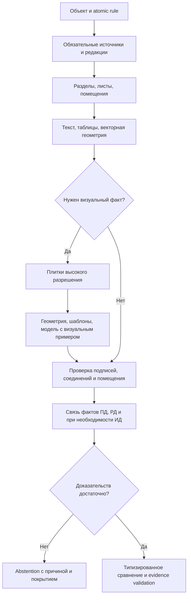

# Обработка документов, геометрия и связывание

Версия 1.2. Целевые контракты этапов реализуются в Python и intake-модуле Node; ответственность за состояние — API. [Jobs](05_JOBS_AND_EVENTS.md) задаёт delivery и deadlines. Форматы и лимиты уточнены по [Q&A](../HACKATHON_QA_SESSION.md). Порядок извлечения определяется [ADR-012](01_DECISIONS.md#adr-012-маршрутизация-доказательств-по-параметру).

## 1. Intake и доверенные границы

Обычный интерактивный upload: до 50×1024² байт на файл, до 200×1024² байт содержимого файлов в пакете. Сессия подтвердила, что эти пределы относятся к действиям инспектора в интерфейсе, а крупный corpus может поступать отдельным trusted import. Разница МБ/МиБ и нагрузка 10×50 МБ всё ещё требуют письменного подтверждения; выбранное v1-поведение сохраняет текущие byte limits. Reverse proxy допускает multipart overhead, а API считает именно содержимое файлов. Content-Length клиента не является единственным источником размера.

Приём потоковый: quarantine → hash → MIME/signature → AV → структурная валидация → immutable originals → DB commit. Расширение и stage от пользователя — подсказки. При недоступности AV данные остаются в карантине, анализ не запускается. Для archive-derived files AV выполняется и на контейнере, и на извлечённом содержимом до регистрации originals.

Первый рабочий pipeline R1 поддерживает PDF, включая digital/layered exports из САПР и сканы. DOCX/XML intake может хранить оригинал, но статус ANALYSIS_UNSUPPORTED остаётся явным до подключения extractor. Нельзя помечать такой файл полностью обработанным. DWG не входит в обязательный хакатонный путь; DWG и архивы активируются только через qualified adapters. Отклонение неподдержанного формата объясняется пользователю до запуска.

| Формат | Структурная проверка | Производный источник |
|---|---|---|
| PDF | Читаемость структуры/страниц, шифрование, page count, контрольный render | Original PDF pages |
| DOCX | Container limits, обязательные XML parts, relationships, запрет внешних обращений | Семантическая структура и PDF фиксированного renderer/font set |
| XML | Ограниченный parser без внешних сущностей/DTD, encoding, корень и profile schema | XPath/element locator; при необходимости стабильное печатное представление |
| DWG | Qualified converter, model/paper spaces, units, layers, корректность конверсии | Layout/page mapping к оригиналу |
| ZIP/7z/RAR | Quotas до и во время extraction, encrypted/unsupported policy | Parent hash, member path/hash, canonical source registrations |
| TXT | Encoding и plain-text profile | Line/character locator, без выдуманной PDF-страницы |

Для контейнеров задать начальный профиль: глубина вложенности ≤2, entries ≤1000, суммарный распакованный размер ≤1 GiB, ratio ≤100, запрет symlink/absolute/parent traversal. Это проектные защитные defaults, а не цифры ТЗ; валидный файл сверх лимита получает явный RESOURCE_LIMIT с маршрутом для оператора. DOCX проверяется как отдельный профиль с лимитами package parts. Extraction работает в изолированном scratch-каталоге с CPU/RAM/time/disk quotas.

Trusted dataset import — отдельная администраторская команда с allowlist manifest и точной сверкой SHA. Она не меняет лимит пользовательского upload и не отключает AV/изоляцию. Доступ к файлам >50 МиБ разрешается только согласованным profile. Нельзя переименовывать официальный file_id или перенумеровывать source PDF pages после внутреннего разбиения.

## 2. Контракты этапов

| Этап | Input | Output | Качество/ошибка |
|---|---|---|---|
| inventory | Source refs, format profile | Page inventory, source metadata, supported operations | CORRUPT, ENCRYPTED, UNSUPPORTED |
| render | Source hash, page selector, render config | Page geometry, preview, tile pyramid, transforms | RESOURCE_LIMIT, RENDER_FAILED |
| text-layer | PDF/page | Words/spans/quads, reading order candidates, quality | text-layer quality, пустой слой |
| OCR/layout | Page/tiles, language profile, adapter release | Tokens, boxes, tables/cells, region types, raw OCR | LOW_QUALITY, OCR_FAILED, regions abstained |
| metadata | Stamps/title blocks/text with locators | Field assertions, stage segments, revision/approval candidates | AMBIGUOUS_METADATA |
| extraction | Rule target schema, relevant regions | Typed values with fragment refs and units | VALUE_NOT_FOUND, VALUE_AMBIGUOUS |
| linking | Manifest, metadata, entity candidates | Selected source set, alternatives, reasons | APPROVAL_UNKNOWN, REVISION_CONFLICT, AMBIGUOUS_LINK |
| evidence validation | Result values + selected sources | Complete evidence bundle / typed failure | INVALID_PAGE, OUT_OF_BOUNDS, CROSS_OBJECT_REFERENCE |

Ошибки этапов не превращаются в предметные отрицательные результаты. Для каждой extraction сохраняются raw text/value и normalized representation, adapter/config version, source hash и locators.

### 2.1. Маршрутизация по параметру

Входом служит frozen manifest объекта и контракт atomic rule: `parameter_code`, применимость, обязательные стадии/редакции, entity scope, `extraction_targets` и `evidence_requirements`. До содержательного поиска отсекаются чужой объект, неподходящая стадия и непригодная редакция. По метаданным и тексту выбираются разделы, листы и помещения; ранжирование не отменяет эти ограничения. ИД требуется только там, где её предусматривает правило.

На выбранных листах сначала используются пригодный текстовый слой, таблицы и векторные линии/контуры с координатами PDF. Для сканов или плохого текстового слоя OCR восстанавливает текст и его привязку. Только если правило требует графический факт и векторный анализ с текстом его не подтвердили, рендерятся выбранные области без потери мелких знаков. Геометрические признаки, несколько проверенных шаблонов и локальная модель с визуальным примером могут параллельно предлагать рамки кандидатов. Кандидат содержит source hash, исходную страницу, координаты, способ поиска и score с указанным смыслом; ближайший шаблон не становится автоматическим совпадением. Дубликаты соседних плиток объединяются в координатах исходного листа.

Перед передачей правилу кандидат сверяется с подписями, выносками, соединениями и помещением. Связь между ПД/РД/ИД строится по объекту, системе, сущности и scope, а не только по похожей форме. Если лист, помещение или связь не установлены, результат остаётся неоднозначным. Для вывода об отсутствии элемента требуется документированное полное покрытие требуемых листов и областей; пустая плитка или отсутствие ответа модели недостаточны.

Это целевой порядок, не заявление о реализации новых providers в текущем release. Проверка по полным кейсам описана в [evaluation](09_EVALUATION_AND_MODELS.md).

## 3. OCR и layout

Сначала проверить текстовый слой: допустимые символы, покрытие, координаты, чтение в правильном порядке, отсутствие очевидных encoding errors. Если он пригоден, использовать напрямую. OCR делать для сканов и проблемных регионов; не дублировать безусловно весь корпус.

Текущий исполняемый срез реализует первый детерминированный filter: `text-layer-quality-v1` помечает пустой слой, отсутствие букв/цифр и replacement/control anomalies как `OCR_REQUIRED`; остальные страницы получают `TEXT_LAYER_CANDIDATE`. Этот статус не равен «пригоден»: покрытие, reading order и соответствие raster ещё не проверяются. При ненулевом числе проблемных страниц API уже вставляет persisted `DOCUMENT_OCR_LAYOUT` job между render и metadata, но до выбора локального OCR/layout provider этот job сохраняет только `PROVIDER_NOT_CONFIGURED` с нулевым output. Если проблемных страниц нет, OCR job не создаётся.

Baseline language profile rus+eng; распознавать технические индексы, кириллицу/латиницу и знаки размеров без безусловного удаления пунктуации. Не менять регистр шифра, если это может менять идентичность. CER-нормализация для evaluation и нормализация инженерного значения — разные операции.

Таблицы возвращают row/column spans, заголовки, units и cell evidence. Штампы — отдельный schema extractor. Подпись/печать распознаётся как визуальный признак, не как криптографически подтверждённая подпись. Статус approval требует согласованной предметной политики и источника.

Крупный лист: coarse pass для regions, затем tiles выбранных областей при ≥300 dpi для OCR-приёмки. Начальный tile profile: 2048×2048 pixels с overlap 128; настраивается benchmark, версия фиксируется. Рендерить без создания всего огромного bitmap в памяти. Повторные tokens в overlap объединяются по геометрии/тексту, исходные координаты не теряются.

## 4. Геометрический контракт

Canonical page frame: видимая область после CropBox и Rotate, origin top-left, x вправо, y вниз, coordinates [0,1]. Хранить MediaBox/CropBox/Rotate, размеры в points и pixels, affine transform source→visible, visible→raster и tile offset/scale. Для каждого renderer transform проверяется на контрольных точках.

BBox: [x0,y0,x1,y1], polygon: ordered normalized points. Ориентация и crop учитываются **один раз** на входе canonical geometry. UI не применяет Rotate второй раз. В overlay не угадывать координаты по размеру миниатюры: использовать canonical frame и actual viewport transform.

Page numbers: source_pdf_page_number и rendered_page_number раздельны. sheet_number извлекается из штампа и может быть строкой. Для DOCX/XML/DWG сохраняется original locator и conversion manifest. До согласования конкурсного mapping нельзя экспортировать rendered page как якобы исходную PDF-страницу.

Preview-level rectangle не считается IoU evidence. Если правило основано на отсутствии элемента, хранить проверенную область поиска и reason why complete; рамка на произвольном пустом месте не доказывает отсутствие.

## 5. Metadata и mixed stages

Stage hint, extracted stage и human resolution хранятся раздельно. RD_ID_MIXED требует document/page segmentation. Один файл может содержать несколько логических документов; file count остаётся один, counts stage assignments — отдельный показатель. UNKNOWN сохраняется до разрешения.

Document family key: object + discipline + normalized code + logical scope (секция/система/том), с provenance каждого компонента. Имя файла и timestamp загрузки сами по себе не определяют актуальность.

Approval states: APPROVED, NOT_APPROVED, UNKNOWN, CONFLICTING. «Похож на штамп утверждения» — assertion с quality, не безусловное APPROVED. Правило применимости approval к типу документа фиксируется versioned policy; если конкретный тип законно не требует такого признака, это явная policy exception с основанием, не default.

## 6. Revision resolver

1. Ограничить кандидатов объектом, разрешённым manifest, discipline/code/entity scope.
2. Построить successor/predecessor graph и проверить циклы/пропуски.
3. Определить применимость на as_of_date проверки, статус утверждения и ссылки на изменения.
4. Выбрать максимальную применимую утверждённую редакцию только при однозначном порядке.
5. При двух несовместимых утверждённых редакциях, неизвестной действительности или разрыве порядка — CLARIFICATION_REQUIRED.
6. Сохранить выбранные и отвергнутые версии, причины, evidence утверждения и alternatives.

Human resolution сохраняет основание и создаёт новый manifest/run. Старый вывод не изменяется. Нельзя выбирать «последний загруженный» при более ранней дате approval или отсутствии связи семейства.

## 7. Linking

Hard gates: тот же объект, разрешённые stages, сопоставимая family/entity, применимая утверждённая версия. Retrieval по тексту/embeddings ранжирует кандидатов после этих ограничений. Score не отменяет hard gate.

Output: link_id, run_id, entity_key, selected document_version_ids, role expected/actual/context, stage pair, reason_codes, alternatives с scores, decision_origin, version of linking policy. Порог auto-link выбирается на validation, frozen в release; до калибровки сомнительная связь идёт в review.

ПД↔РД, ПД↔ИД и РД↔ИД разрешаются rule-specific. Отсутствие третьей неприменимой стадии не блокирует допустимую пару. Для отсутствующего обязательного источника возвращается MISSING_EVIDENCE, для неопределённой редакции — CLARIFICATION_REQUIRED.

## 8. Qualification providers

Перед выбором provider зафиксировать benchmark fixtures: digital PDF, scan, rotated/cropped sheet, большой чертёж, stamp, table, DOCX/XML и повреждённый вход. Сравнить качество, память, latency, offline-install, license/deployment ограничения. Выбрать один default renderer и OCR provider для R1, сохранить exact artifacts/config и отчёт. Замена provider — новый release и повтор geometry/OCR regression, не незаметный dependency update.
