# План реализации и доказательства готовности

Версия 1.2. Это backlog для разработки, а не отчёт о завершённых работах. Хакатонные приоритеты уточнены по [Q&A](../HACKATHON_QA_SESSION.md). Owner ниже — роль, конкретных исполнителей назначает команда. Оценку часов нельзя достоверно дать без состава команды, доступного оборудования и оригиналов; зависимости и критерии готовности фиксируются уже сейчас. Порядок предметного анализа задаёт [ADR-012](01_DECISIONS.md#adr-012-маршрутизация-доказательств-по-параметру).

## Порядок

```mermaid
flowchart LR
  G0[Контракты и входные данные] --> G1[Долговременное состояние и identity]
  G1 --> G2[Jobs и реальный ingest]
  G2 --> G3[PDF extraction и geometry]
  G3 --> G4[Revision linking и первые правила]
  G4 --> G5[Review, дозагрузка, протокол]
  G5 --> R1[Ограниченный честный прототип]
  R1 --> G6[Расширение покрытия и форматов]
  G6 --> G7[Evaluation, GOLD, модельные релизы]
  G7 --> G8[Пилот, нагрузка, recovery, ИАИС]
```

Evaluation fixtures и UI contracts начинают готовить с G0, а не после всего backend. Команды могут работать параллельно по зафиксированным DTO: backend/data, document/ML, frontend, QA/infra. Это рекомендуемое распределение работ команды, не запуск агентов или создание внешних задач.

## Backlog

| ID / этап | Результат | Зависит от | Owner | Definition of Done |
|---|---|---|---|---|
| B01 / G0 | Реестр требований и входных артефактов | — | Lead + product | ТЗ/hash, список missing schema/scorer/originals; Q-01…Q-16 имеют owner и blocker |
| B02 / G0 | OpenAPI, enum registry, events schemas | Архитектура 02–05 | Backend | Все routes/parameters/errors описаны, validators/generated clients проходят contract fixtures |
| B03 / G0 | Qualification corpus и provider profile | Разрешённые оригиналы, Q-05/06 | Document/ML | Текст, сканы, таблицы, штампы, rotated/cropped/large sheets; выбран локальный renderer/OCR/layout/model profile с доступными weights, допустимыми лицензиями и замерами; внешних AI API нет |
| B04 / G1 | PostgreSQL domain repositories и migrations | B02 | Backend | FK/unique/check constraints; restart сохраняет objects/runs/review/protocols; seed только demo |
| B05 / G1 | Identity, object scope, audit | B04 | Backend + infra | Actor только серверный; role tests; недоступные objects не читаются; audit transactional |
| B06 / G2 | Upload sessions, AV, structural validation, storage | B04/05 | Backend + document | Реальные bytes; лимиты end-to-end; повреждённый PDF отклонён; scan fail-closed; dedup и atomic commit |
| B07 / G2 | Outbox, job DAG, leases/fences, retries | B04/05 | Backend + infra | Crash/retry suite из 05 проходит; результат durable; нет таймера готовности |
| B08 / G3 | PDF render/text/OCR/layout/vector geometry/stamps, locator | B03/06/07 | Document/ML | Новый PDF даёт текст, таблицы и доступную векторную геометрию с source page/координатами; OCR только при непригодном слое; raw→normalized provenance и bbox проверены; pipeline не читает labels |
| B09 / G4 | Metadata, applicability, revision resolver, scoped retrieval и linking | B08 | Document/ML + эксперт | Для параметра выбраны правильные объект, стадия, редакция, раздел, лист и помещение; conflicts/unknown approval → clarification; mixed pages и entity identity проверены |
| B10 / G4 | Runtime rule registry и coverage ledger | B02/09 | Rules/backend | Все 132 перечислены; R1 subset реально исполняется; остальные UNSUPPORTED; результаты и знаменатели вычисляются |
| B11 / G4 | Первые предметные правила и условная графическая ветка | B09/10, Q-04 | Rules + Document/ML + эксперт | Числовое, категориальное и одно presence/context семейство имеют реальные positive/negative/boundary fixtures и полный evidence; геометрия/шаблоны/visual prompts дают только проверяемых кандидатов; отсутствие требует покрытия листов |
| B12 / G5 | Review items, split/promotion, decisions | B05/11 | Backend + frontend | Immutable machine outputs; reason codes; stale/repeated/concurrent commands; GOLD только draft candidate |
| B13 / G5 | Evidence workspace и реальные progress/errors | B02/08/12 | Frontend | Все страницы/источники, геометрия, версии, original; 412/409 UX; pending/unsupported не выглядят проверенными |
| B14 / G5 | Дозагрузка и безопасное повторное использование | B09/12/13 | Backend + document | Manifest v2, новый run; changed dependencies invalidated; exact inherited decisions с provenance; история сохранна |
| B15 / G5 | Immutable snapshots, finalize/revoke, JSON/PDF | B12/14, Q-07 | Backend + frontend | Гонки и блокировки проверены; old protocol bytes/hash неизменны; render failure независим; форма приложения сверена |
| B16 / G5–7 | Inference export и scorer adapter | B10/11, Q-01/02/04 | Backend + ML | Export до review; официальный schema/matching test; raw IDs/location; human actions не меняют predictions hash |
| B17 / G6 | DOCX/XML и согласованные дополнительные форматы | B08, Q-03/08 | Document | End-to-end source/rendered mapping; каждый формат имеет fixtures; принятие файла не выдаётся за способность анализировать |
| B18 / G6 | Остальные 132, нормы, free search | B10/11, Q-04/15 | Rules + эксперт | Реестр по каждому параметру; typed rules; версия норм; SUSPICION→manual promotion с evidence; no invented approvals |
| B19 / G7 | Curated GOLD, evaluation, model registry/gate | B03/12/16, Q-06 | ML + curator | Object-isolated datasets; полные листы и сквозные кейсы сравнивают извлечение/поиск/привязку/итоговый вывод; все метрики/denominators/CI; pass/fail release gate; rollback для новых runs |
| B20 / G8 | SLO/load/resource profile и UX acceptance | B13–19, Q-09 | QA + infra + inspectors | 100 users, OCR/compare/render/incremental timings; пять инспекторов; доказательства/known limitations сохранены |
| B21 / G8 | Backup/PITR, restore, эксплуатационные runbooks | B04/07/15, Q-12 | Infra | Проверены RPO/RTO, восстановлены originals/snapshots, сверены hash; безопасный redrive и alerts |
| B22 / G8 | ИАИС facade/delivery/signature adapter | B05/15, Q-10/11 | Integration | Официальный sandbox contract; only confirmed valid FINAL; retries/reconciliation/revocation и подпись проверены |
| B23 / все | Документация запуска и release evidence | Все принятые задачи | Lead/QA | Инструкция проверена на чистой машине, ограничения отражены в UI/status, release manifest воспроизводим |

B16 может быть BLOCKED_CONTRACT без остановки локального pipeline, но конкурсная совместимость тогда не заявляется. B22 имеет более низкий приоритет для первого вертикального среза, однако остаётся в полном объёме ТЗ. High-приоритеты ML/free search нельзя объявить исключёнными из итоговой поставки без согласования Q-16.

Основа для декомпозиции B10/B11/B18 по конкретным кодам — [матрица всех 132 параметров](14_PARAMETER_IMPLEMENTATION_MATRIX.md).

## Релизные границы

**R1 — реальный ограниченный прототип / первый этап хакатона.** B01–15 в применимой части; рабочий High-контур, выбранный и явно перечисленный subset правил, PDF, persistence, scoped actor, durable jobs, настоящий evidence viewer, дозагрузка и сохранный протокол. Неисполненные параметры видны. Обязательный demo: ранее не виденный системой разрешённый файл → результат из его bytes → решение → новый manifest → новый run → финальный snapshot. Без оригиналов этот gate не закрывается; seed не заменяет его. DWG, live ИАИС/УКЭП и 100-user load test в этот gate не входят.

**R2 — функциональная полнота согласованного хакатонного scope.** B16–19, согласованные обязательные форматы, все требуемые семейства матрицы, свободный поиск, управление нормами/моделями, официальный export. По каждому из 132 параметров либо принята реализация и fixtures, либо явно зафиксирован непокрытый объём; наличие строки UNSUPPORTED не закрывает требование.

**R3 — пилотная/эксплуатационная приёмка.** B20–22, инфраструктура и внешние контракты, включая 100-user load, эксплуатационные испытания, live ИАИС и согласованный профиль подписи. Полнота интерфейса или красивое демо не заменяют performance/quality acceptance. Ни один из R1–R3 сейчас не отмечается выполненным этой документацией.

## Матрица приёмочных сценариев

| ID | Сценарий | Наблюдаемое доказательство |
|---|---|---|
| T01 | Два разных объекта, одинаковые коды/названия документов | Evidence и результаты никогда не пересекают object scope |
| T02 | API/worker/DB reconnect и restart | Данные сохранены, job завершается один раз, frontend восстанавливает состояние |
| T03 | Потеря response/ack после commit, duplicate message | Один result/decision/protocol; сохранённый receipt возвращается повторно |
| T04 | Lease expiry, старый worker завершает позже нового | Старый fence отвергнут; активный run не изменён |
| T05 | Загрузка, запуск и финализация конкурируют | Ровно один допустимый переход; нет файла, добавленного в закрытый snapshot |
| T06 | Два инспектора принимают разные решения по одному item | Один commit, второй 412; история без lost update |
| T07 | Ошибка OCR против действительно отсутствующего документа | FAILED отличается от MISSING_EVIDENCE; не растёт число negative/violations |
| T08 | Неизвестное согласование, более новая неутверждённая редакция, конфликт | Выбор/отказ воспроизводим и объясним; неизвестность не выдана за approved |
| T09 | CropBox/Rotate, bbox, PDF page≠sheet, mixed stages | Исходник и overlay совпадают, evidence scope не подменён |
| T10 | Порог ровно на границе, единицы, zero baseline, категории | Typed comparator даёт ожидаемый предметный результат/abstention |
| T11 | UNSUPPORTED / partial entity discovery | 132 ledger rows, честное покрытие, нет отрицательного результата «по умолчанию» |
| T12 | Дозагрузка изменённой и независимой редакции | Зависимые результаты пересчитаны; перенос только при exact fingerprint/отсутствии competing revision |
| T13 | Split/promote и исправление решения | Frozen machine predictions прежние; review lineage и GOLD candidates атомарны |
| T14 | Finalize → render failure → retry → revoke → новый run | Старый snapshot/артефакт не меняется; отзыв и новая версия видны; есть audit |
| T15 | Официальный export до и после human review | Одинаковый frozen prediction hash; schema/reference/matching validation |
| T16 | Hidden isolation / отрицательных labels нет / duplicated predictions | Нет leakage; FPR NOT_ESTIMABLE; one-to-one matching не удваивает TP |
| T17 | Новая модель хуже в категории / rollback | Gate блокирует выпуск по условиям 09; прошлые protocols неизменны |
| T18 | Крупная/повреждённая/неподдержанная загрузка; scanner unavailable | Точные лимиты и причины; карантин не становится доступным evidence |
| T19 | ИАИС timeout/retry/revocation/unknown receipt | Отправка только valid FINAL; дубликаты контролируются; состояние sync отдельно |
| T20 | Нагрузочные/UX/restore испытания | Отчёты с hardware, составом данных, методикой, временем и фактическими результатами |

Это задания на будущие тесты. Документационный change не создаёт фиктивные зелёные test results. При реализации unit tests концентрируются на правилах/переходах/геометрии; integration — на PostgreSQL+RabbitMQ+storage и crash cases; E2E — на сквозных сценариях. Тест только mock-функции недостаточен для приёмки persistence или queue integration.

## Трассировка аудита

| Замечание | Архитектурное исправление | Backlog | Приёмка |
|---|---|---|---|
| A01: seed вместо нового анализа | Изолированный demo, file→run pipeline | B04, B07–11 | T01, R1 demo |
| A02: статические метрики/confidence | Coverage ledger, nullable calibrated components | B10, B13 | T11 |
| A03: строковое сравнение | Typed rules, revision/applicability/evidence gates | B08–11, B18 | T07–10 |
| A04: обход финализации | Общий inspection gate, locks, immutable history | B12, B15 | T05, T06, T14 |
| A05: изменяемые версии протокола | Canonical snapshot + immutable artifacts | B15 | T14 |
| A06: память/нет доставки | PostgreSQL, outbox, leases, durable receipts | B04, B07 | T02–04 |
| A07: дозагрузка создаёт новый объект | Intake текущей inspection, manifest/run versions | B14 | T12 |
| A08: комплектность по наличию файлов | Требования rules/scenario, scope/quality | B09, B10 | T07, T11 |
| A09: статичный viewer | Page/render transform, все источники/версии | B08, B13 | T09, T20 |
| A10: недоказанный submission | Frozen machine export и verified adapter | B16 | T15, T16 |
| A11: нет identity/audit | Capabilities/object scope, actor server-side | B05 | T01, T06, T14 |
| A12: лимит proxy | End-to-end byte caps и streaming profile | B06 | T18 |
| A13: OpenAPI skeleton | Полные schemas/parameters/errors/generated clients | B02 | Contract validation |
| A14: слабая provenance-модель | Immutable versions/locators/metadata/evidence/review lineage | B04, B08, B12 | T08, T09, T13 |
| A15: только сигнатура PDF | Structural validation и bounded render | B06 | T18 |
| A16: ошибки/долгий progress | Persisted DAG read model и recovery UX | B07, B13 | T02, T07, T20 |

INV-01/03/12 покрываются T01/T16; INV-02/07 — T12/T13/T15; INV-04/11 — T07/T11; INV-05/06 — T06/T08; INV-08 — T14; INV-09/10 — T03/T04; INV-13 — T19; INV-14 — T18. В release report ссылки ведут к фактическим log/artifact/test results, не только к этой таблице.

## Миграция текущего проекта

1. Сохранить текущий демонстрационный seed в отдельном demo profile; запретить fallback на него в NORMAL. Не переносить учебные решения в реальные проверки.
2. Ввести contracts/domain repositories и БД; существующий `store.ts` остаётся только demo adapter на переходный период. Проверить отсутствие обращений к нему из normal service wiring.
3. Существующие зарегистрированные оригиналы инвентаризировать по hash/AV provenance. Импортировать metadata с origin=LEGACY только после сверки; ссылки из in-memory seed не считать реальным source manifest. Сохранять исходные файлы, не удалять их при миграции.
4. Подключить worker protocol/outbox вместо timeout. Удаление fake completion — до заявления R1.
5. Перевести frontend на v1; legacy endpoints используют тот же command layer и запреты. Затем удалить legacy route adapter отдельным change.
6. Исторические demo protocols маркировать DEMO/UNVERIFIED_HISTORY; нельзя задним числом представлять их криптографически сохранными финальными snapshots. Новые протоколы выпускаются только через B15.
7. Обновить README, status, команды запуска и OS-совместимый check. Отдельно проверить Windows и контейнерный Linux; текущая shell-зависимость PYTHONPATH уже известна из аудита.

## Артефакты выпуска

Release manifest; версия requirements mapping; accepted parameter registry; список known gaps; contracts; DB migration/rollback plan; dataset/provider manifests; evaluation report с raw counts и CI; E2E/crash/load/UX/restore reports; demo script на новых документах; protocol/export samples; эксплуатационная инструкция. Если обязательный внешний контракт не получен, его статус BLOCKED и граница заявления о готовности указаны явно.
